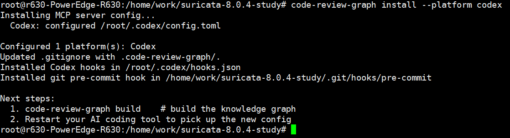
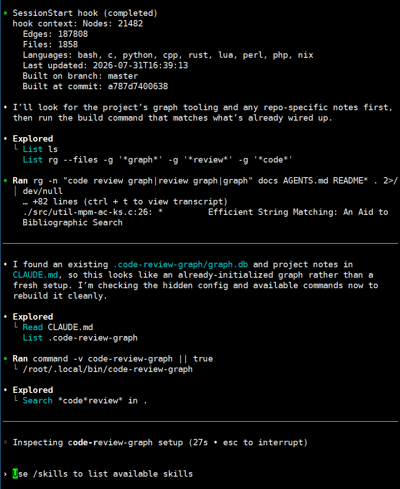

方案 1：用 pipx 安装命令行工具，推荐

如果 code-review-graph 是一个命令行工具，这是最合适的方式：

sudo apt update
  sudo apt install pipx
  pipx ensurepath

然后重新打开终端，或执行：

source ~/.bashrc

安装：

pipx install code-review-graph

验证：

code-review-graph --help

我在/home/work/suricata-8.0.4-study工程项目目录中执行code-review-graph install，执行结果如下图：



其改动如下

1、修改 /root/.codex/config.toml

新增了 Codex MCP server 配置：

```
[mcp_servers.code-review-graph]
command = "/root/.local/share/pipx/venvs/code-review-graph/bin/python"
args = ["-m", "code_review_graph", "serve"]
cwd = "/home/work/suricata-8.0.4-study"
type = "stdio"
```

作用：让 Codex 启动时可以把 code-review-graph 作为 MCP server 接入。

2、修改 /root/.codex/hooks.json

```
{
    "hooks": {
      "PostToolUse": [
        {
          "matcher": "Write|Edit|Bash",
          "hooks": [
            {
              "type": "command",
              "command": "cat >/dev/null || true; git rev-parse --git-dir >/
              dev/null 2>&1 && code-review-graph update --skip-flows || true",
              "timeout": 30,
              "statusMessage": "Updating code-review-graph"
            }
          ]
        }
      ],
      "SessionStart": [
        {
          "matcher": "startup|resume",
          "hooks": [
            {
              "type": "command",
              "command": "cat >/dev/null || true; git rev-parse --git-dir >/
              dev/null 2>&1 && code-review-graph status || echo 'Not a git
              repo, skipping'",
              "timeout": 10,
              "statusMessage": "Checking code-review-graph status"
            }
          ]
        }
      ]
    }
  }

```

作用：

- Codex 使用 Write|Edit|Bash 后，自动执行：

  code-review-graph update --skip-flows

- Codex 会话启动/恢复时，自动执行：

​	code-review-graph status


3、新增/覆盖 .git/hooks/pre-commit

```
#!/bin/sh
# Installed by code-review-graph. Remove this file to disable pre-commit graph checks.
if command -v code-review-graph >/dev/null 2>&1; then
    code-review-graph update || true
    code-review-graph detect-changes --brief || true
fi
```

作用：执行 git commit 前自动更新 graph，并做变更检测。


然后执行命令code-review-graph build


疑问点：

code-review-graph采用了graph图技术，那么什么时候更新呢？




claude code配置code-review-graph组件后修改的内容：

```
{
  "mcpServers": {
    "code-review-graph": {
      "command": "/root/.local/share/pipx/venvs/code-review-graph/bin/python",
      "args": [
        "-m",
        "code_review_graph",
        "serve"
      ],
      "cwd": "/home/work/suricata-8.0.4-study",
      "type": "stdio"
    }
  }
}
```

.mcp.json:1 是 Claude Code 的 MCP 配置。它注册了一个名为 code-review-graph 的 MCP server，/root/.local/share/pipx/venvs/code-review-graph/bin/python -m code_review_graph serve在当前项目目录/home/work/suricata-8.0.4-study 里启动。

| 类别            | 文件/目录                                | 添加内容                                                     | 作用                                                 |
| --------------- | ---------------------------------------- | ------------------------------------------------------------ | ---------------------------------------------------- |
| MCP 配置        | .mcp.json                                | 注册 code-review-graph MCP server                            | 让 Claude Code能启动并连接知识图谱服务               |
| Claude 启动说明 | CLAUDE.md                                | 追加 code-review-graph MCP tools 使用说明                    | 提醒 Claude 优先用图谱工具探索代码、查影响、做review |
| Claudehooks     | .claude/settings.json                    | SessionStart、PostToolUse hooks                              | 会话开始显示图谱状态；编辑/写文件后自动增量更新图谱  |
| Claude skill    | .claude/skills/debug-issue/SKILL.md      | 调试问题流程                                                 | 指导 Claude 用图谱查调用链、执行流、影响范围         |
| Claude skill    | .claude/skills/explore-codebase/SKILL.md | 探索代码库流程                                               | 指导 Claude 查看架构、模块、函数/类、调用关系        |
| Claude skill    | .claude/skills/refactor-safely/SKILL.md  | 安全重构流程                                                 | 指导 Claude 在重构前查影响范围、死代码、重命名影响   |
| Claude skill    | .claude/skills/review-changes/SKILL.md   | 代码审查流程                                                 | 指导 Claude 做变更风险分析、影响路径、测试覆盖检查   |
| Git hook        | .git/hooks/pre-commit                    | 提交前运行 code-review-graph update 和 detect-changes --brief | commit 前自动更新图谱并输出风险摘要                  |

一句话总结：

这次安装主要是在 Claude Code 侧加了三层能力：.mcp.json 负责连接图谱服务，.claude/settings.json 和 Git hook 负责自动更新图谱，CLAUDE.md 与 .claude/skills/ 负责告诉 Claude 什么时候、怎么使用图谱。