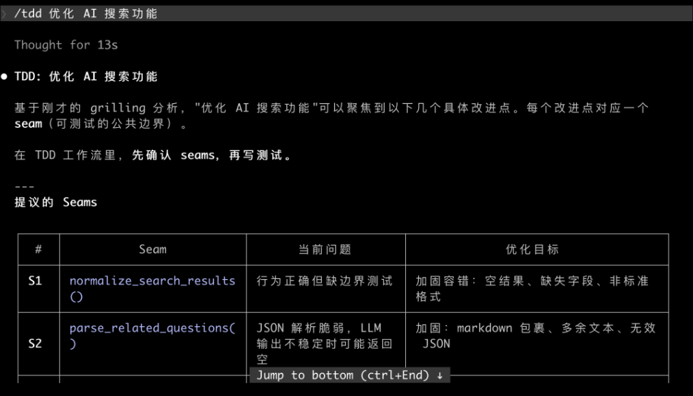
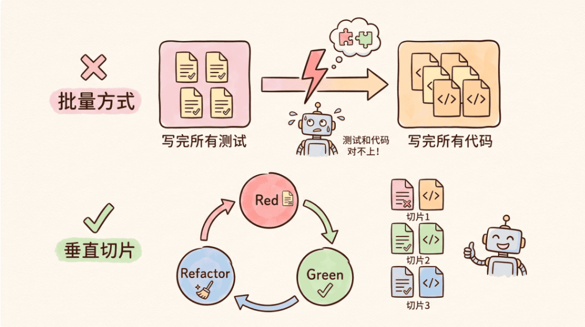

快速开始：

```bash
npx skills add mattpocock/skills --skill=implement
```

```bash
npx skills update implement
```

[源代码](https://github.com/mattpocock/skills/tree/main/skills/engineering/implement)


## 它做什么

`implement` 解决的是构建链条里最实际的那一步：**把已经写清楚的方案，真正变成代码**。

这个方案可以是一份规格（spec），也可以是一组已经排好顺序的 tickets（任务卡）。

`implement` 的实现过程遵循测试驱动开发（TDD）：先写一个会失败的测试，再写刚好足够的代码让它通过。每推进一小步，它都会做类型检查、运行相关测试；全部完成后，再进入代码审查（review），并把改动提交到当前分支。

这里最重要的边界是：**`implement` 不负责决定要构建什么**。

到了这一步，规格应该已经定下来，测试边界也应该已经约定好。`implement` 做的是执行计划，而不是重新讨论方案；真正的需求判断发生在上游。


## 什么时候用它

你通过输入 `/implement` 来调用它。智能体不会主动选用这个 skill。

当工作已经写成规格（spec），或者已经拆成任务卡，并且你准备把它变成代码时，就该用它。

如果规格还不存在，先用 [to-spec](https://aihero.dev/skills-to-spec) 写规格（spec）。

如果已经有规格，但还没有拆成具体任务，可以用 [to-tickets](https://aihero.dev/skills-to-tickets) 把它拆成 tickets。

如果你只是想用“测试先行”的方式构建某个东西，但不需要完整规格，就直接使用 [tdd](https://aihero.dev/skills-tdd)。


## 预先约定的测试边界

在开始写代码之前，`implement` 需要先确定一件事：**最后要通过哪个位置来验证功能已经做好了**。

比如，一个功能可以通过 API 测试来验证，也可以通过页面交互测试来验证，还可以通过某个模块的公开接口来验证。

这个“从哪里验证”的位置，就是 **测试边界（seam）**。它不是随手挑一个测试文件，而是功能对外表现最稳定、最适合验证的位置。

测试边界通常会在 [to-spec](https://aihero.dev/skills-to-spec) 阶段先定好。`implement` 不会一边写代码，一边临时决定该测哪里。



上图所示的文字描述，“每个改进点都对应一个seam（可测试的公共边界），在TDD的工作流里，先确定seams，再写测试”。

提议的seams，有两个：normalize_search_results()和parse_related_questions()。


AI实际执行时，它会按这个顺序推进：

- 先根据约定好的测试边界，写一个会失败的测试。
- 再写刚好足够的代码，让这个测试通过。
- 测试通过后，整理一下代码，再进入下一个测试。
- 过程中经常做类型检查，并反复运行相关测试。
- 最后再跑完整测试套件，做一轮代码审查，然后提交到当前分支。

这种一小步一小步推进的方式，就是经典的 **Red-Green-Refactor** 循环。



这样做的好处是：**测试验证的是功能行为，而不是某段具体实现**。只要对外行为没变，内部代码就可以放心调整。


## 它在整个流程里的位置

`implement` 位于主构建链条接近尾声的位置：方案已经定好，任务已经排好，接下来就是把它做出来。

```txt
grill-with-docs → to-spec → to-tickets → implement → code-review
```

换句话说，只有在工作已经写成规格，并且执行顺序已经排好之后，才该使用它。

[to-tickets](https://aihero.dev/skills-to-tickets) 会产出 `implement` 要处理的 tickets，并在每个 ticket 里声明阻塞依赖关系。[tdd](https://aihero.dev/skills-tdd) 则是 `implement` 内部使用的工作方式：先围绕测试边界写测试，再实现代码。

实现完成后，`implement` 会运行自己的 [code-review](https://aihero.dev/skills-code-review) 流程，然后提交改动。

如果你不确定该用哪个 skill 或哪条流程，[ask-matt](https://aihero.dev/skills-ask-matt) 会帮你路由。
