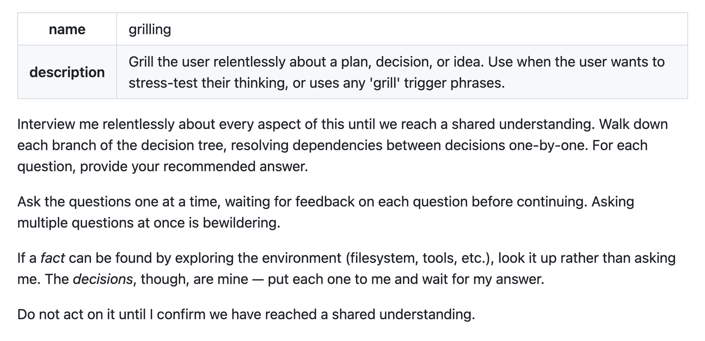

翻译过来是这样的：

针对我的计划、决策或想法，反复追问每一个细节，直到我们形成共同理解。

沿着决策树的每个分支往下走，逐一理清各项决策之间的依赖关系，有些选择必须等前一个问题确定了才能回答，AI 会按这个先后顺序逐个问清楚。每个问题都要给出你的推荐答案。
 每次只问一个问题，等我回答了再问下一个。一次抛出一堆问题会让人不知所措。
 能通过查看环境（文件系统、工具等）找到的事实，直接去查，不用问我。但决策是我来做的，每个决策都要等我拍板。
 确认双方理解一致之前，不要开始行动。

