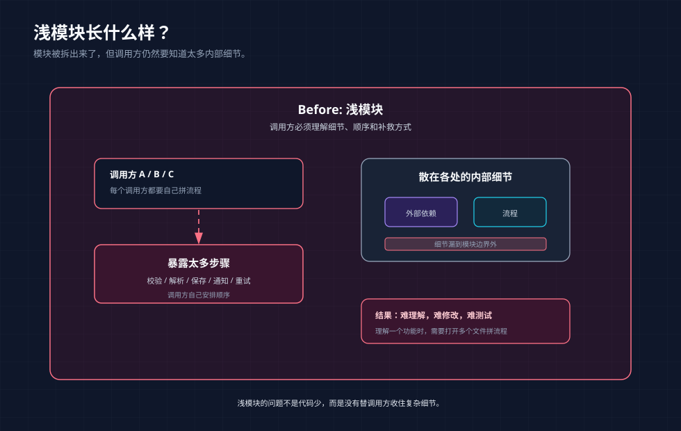
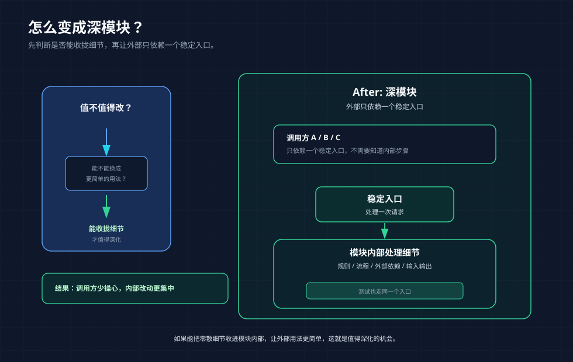
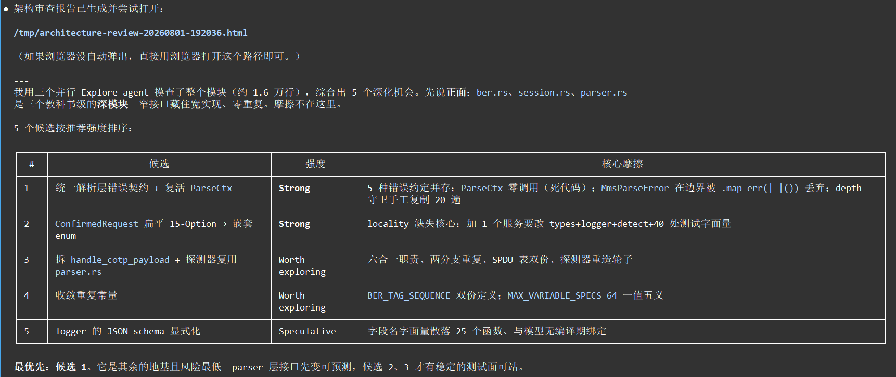
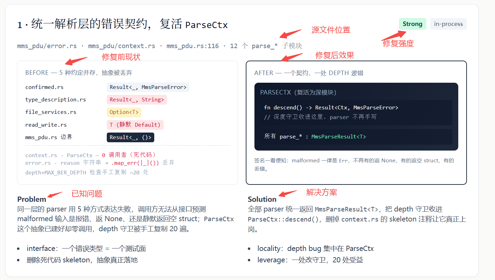
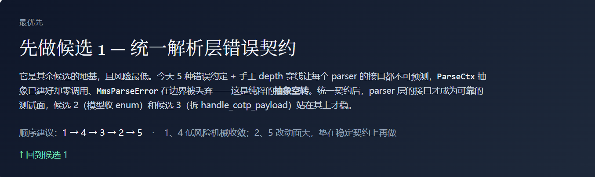

快速开始：

```bash
npx skills add mattpocock/skills --skill=improve-codebase-architecture
```

```bash
npx skills update improve-codebase-architecture
```

[源代码](https://github.com/mattpocock/skills/tree/main/skills/engineering/improve-codebase-architecture)

## 它做什么

`improve-codebase-architecture` 会扫描代码库，寻找 **深化机会（deepening opportunities）**，也就是让浅模块变深的机会。它会生成可视化 HTML 报告，把候选项做成卡片；你选中某一项后，再进入追问流程。

## 什么时候用它

通过输入 `/improve-codebase-architecture` 调用它。这个 skill 是用户主动调用的，智能体不会自行触发它。

把它当成周期性检查：每隔几天跑一次，或者当你发现要在很多小模块之间来回跳着理解一个概念时，就该用它。它会读取现有架构，并建议哪些地方值得深化。

如果你还不确定该改哪里，就用 `improve-codebase-architecture` 先找候选项。如果你已经知道要改哪个模块，只是想细想它对外应该怎么用，请改用 [codebase-design](https://aihero.dev/skills-codebase-design)。

## 它如何确定扫描范围

探索会从最有价值的地方开始：你指定了方向，它就顺着这个方向看；没有指定方向时，它会先看最近哪些代码改动最频繁。

它也会参考 `CONTEXT.md` 和相关 ADR，尽量沿用项目已有的概念和决策，避免重复争论。

## 它寻找什么样的机会

有些模块虽然被拆出来了，但调用它的人还是要知道很多内部细节：先调哪个函数、后调哪个函数，出错时怎么补救，哪些状态要自己维护。这种模块看起来有边界，实际并没有帮你省多少心。




这个 skill 要找的，就是那些可以把细节收回模块内部、让外部用法变简单的地方。通常它会留意三种感觉：理解一个功能时总要打开很多文件；调用一个模块时还得自己安排一串步骤；测试看似很多，却没有覆盖真正的主流程。出现这些情况时，往往说明模块还不够“深”。

判断一个候选项值不值得做，它会问一个问题：如果把现在这个模块拿掉，能不能换成一个更简单的用法，把零散细节收进里面？如果只是把麻烦挪到别处，就不值得。




## 报告会包含什么

输出是一份可直接在浏览器打开的 HTML 文件，写到操作系统临时目录，不会写进仓库。路径形如：

```txt
/tmp/architecture-review-<timestamp>.html
```

每次运行都会生成一个新文件，智能体会告诉你报告的绝对路径。




使用浏览器打开这个html文件，如下图所示：




报告会用卡片展示候选项：涉及哪些文件、当前有什么问题、建议怎么改、为什么值得做，以及改动前后的结构对比。每个候选项都会配一组 **before / after 可视化**，并标出推荐强度：`强烈建议`、`值得探索` 或 `可以观望`。



报告最后会给出 **优先建议**：最建议先处理哪一个，以及为什么。

报告阶段不会先替你设计接口。报告写完后，它会停下来问你：**你想继续看哪一个？**

## 选中候选项之后

报告阶段只负责发现候选项；真正的设计讨论从你选中候选项之后才开始。

选中某个候选项后，它会继续追问关键决策：有哪些约束和依赖、深化后的模块该负责什么、对外暴露什么用法、哪些测试应该继续成立。随着讨论变清楚，它也会更新 `CONTEXT.md` 或相关 ADR，避免以后重复讨论同一个问题。

## 它适合放在哪

`improve-codebase-architecture` 属于 **周期性维护**，不是构建链条中的固定步骤。它通常先找候选项，再把选中的候选项交给 `grilling`、`codebase-design` 和 `domain-modeling` 继续推进。

如果你不确定该用哪个 skill 或哪条流程，[ask-matt](https://aihero.dev/skills-ask-matt) 会帮你选择合适的 skill 或流程。
