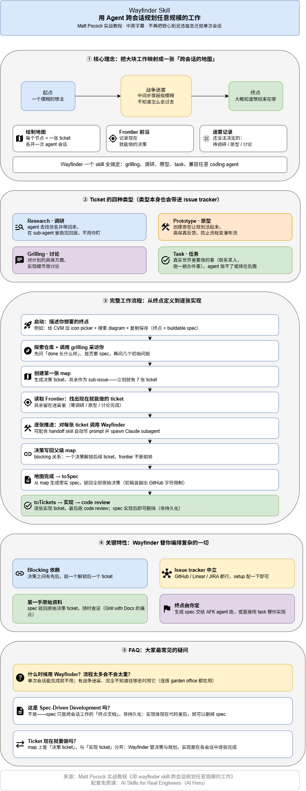
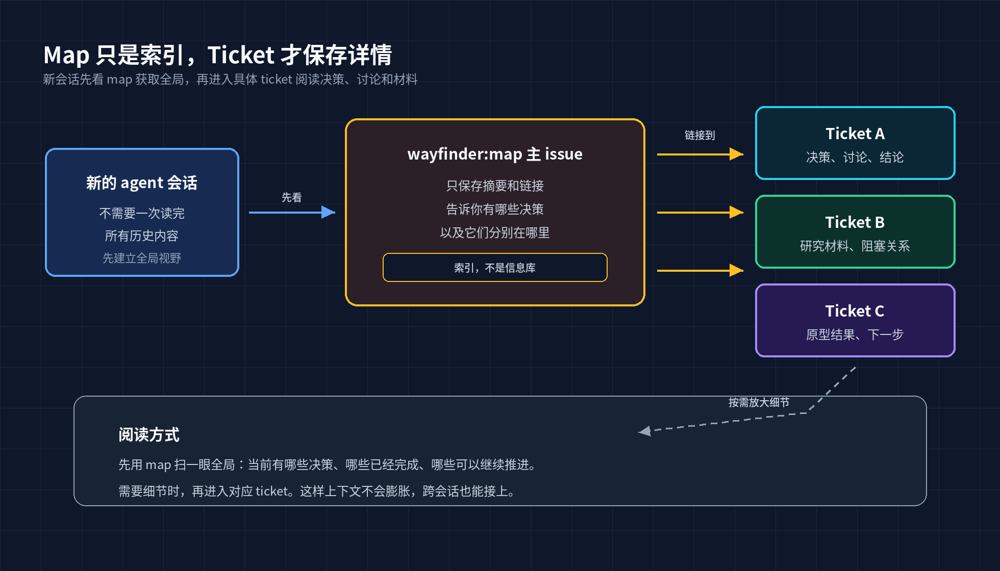
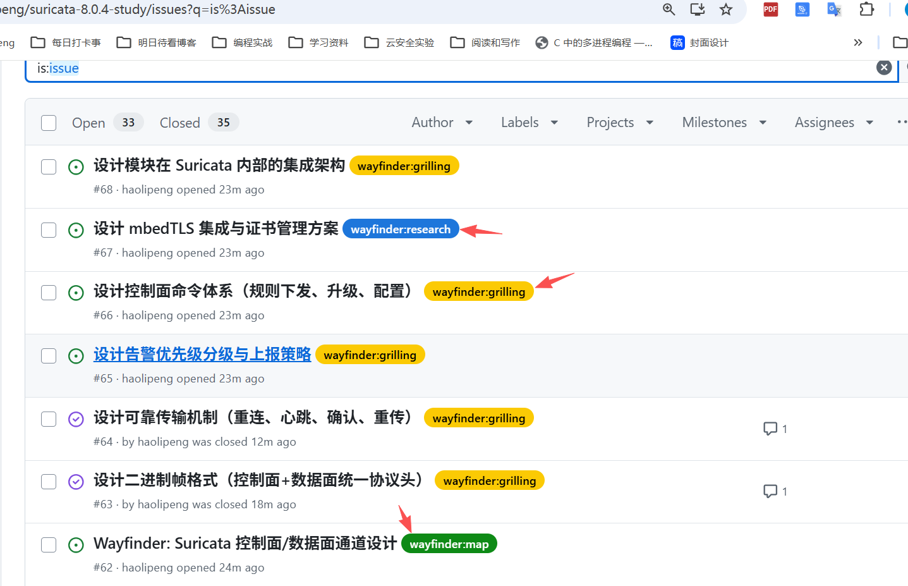
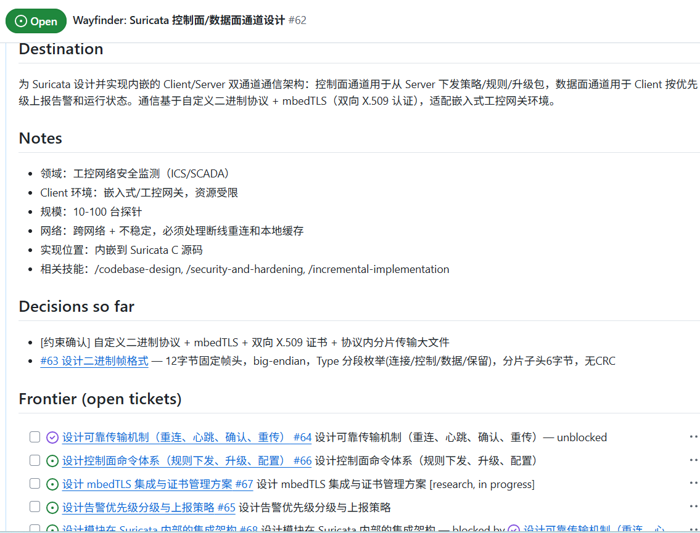
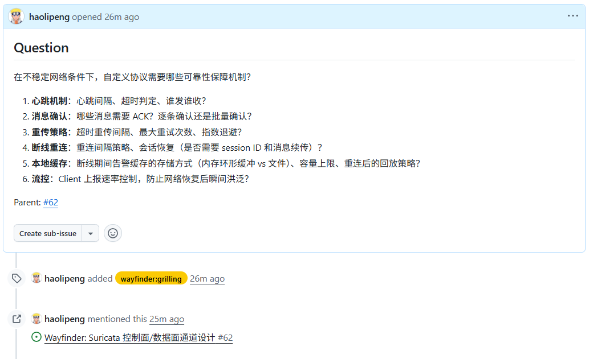
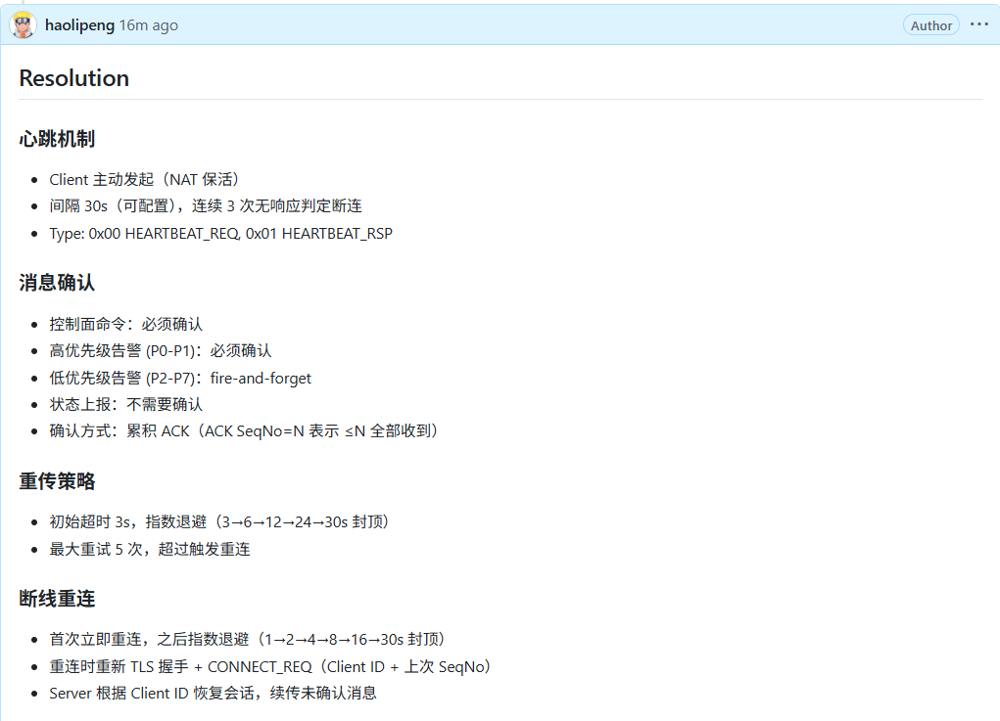

# Wayfinder：用 Agent 跨会话规划复杂工作

一次 agent 会话很适合处理 **边界清楚** 的问题，例如：

- 修一个 bug
- 补一组测试
- 实现一个已经写清楚的接口
- 把一段明确的讨论整理成 spec

只要输入足够清楚，agent 就能在当前上下文里完成探索、修改、验证和总结。

但真实的软件工作里，经常会出现另一类任务：

- 你知道大概要去哪里，却不知道该怎么走
- 目标有轮廓，但路线还不清楚
- 中间肯定有很多决策要做，但现在还说不出完整清单
- 现在就让 agent 写代码还太早，直接写 spec 又容易漏掉关键问题

这类工作卡住的原因，往往不是 agent 不会写代码，而是 **问题还没清楚到可以开始写代码**。你需要的不是马上执行，而是先把未知的部分摊开，把必须回答的问题找出来。

这就是 Wayfinder 要解决的问题。

## 它解决的不是执行问题，而是路线问题

Wayfinder 面向的是那些 **“大、但还没想清楚”** 的工作。

它不会直接做两件事：

- 不会马上替你实现功能
- 不会一上来就产出完整 spec

它做的是更靠前的一步：先把一个模糊的大目标整理成一张可以跨会话共享的 **决策地图**。

这张地图里放的不是“实现任务”，而是 **“决策 tickets”**。每张 ticket 对应一个构建前必须回答的问题。随着这些问题被逐一解决，原本模糊的路线会变得越来越清楚。

只有等 **关键决策** 都完成后，才适合继续写 spec、拆实现 tickets，并进入真正的实现阶段。

所以 Wayfinder 最终留下的不是交付物，而是 **一组已经做出的决策**。它不是一个“更强的实现器”，而是一个 **“跨会话的路线规划器”**。

## 地图不是信息库，而是索引

在 Wayfinder 里，**map 通常是一个主 issue**，下面的每张 ticket 都是它的子 issue。

团队成员或后续 agent 会话只需要围绕这一条共享 URL 协作，就能知道事情推进到了哪里。

但 **map 不是用来存放所有内容的地方**。讨论过程、最终结论、研究材料，都不会全部塞进 map 里。每个决策都有自己的 ticket，详细内容也只写在对应的 ticket 中。

map 只负责告诉你：现在有哪些决策、它们分别在哪里。

如上述所示，详细内容的tickets为64、65、66、67、68等ticket。

这样，新的会话只需要先看一眼 map，就能知道全局进展；如果需要更多细节，再点进具体 ticket 查看。

点击ticket65，点击展开详情。

Question问题列表如下所示：

对应的Resolution如下所示：

这点对 agent 协作尤其重要。单次会话的上下文窗口总是有限的。Wayfinder 的 map **更像目录，而不是正文**；它让后续会话知道应该读哪里，而不是要求后续会话一次读完所有东西。

## 迷雾代表还说不清的问题

在已经明确的 tickets 之外，经常还存在一些你隐约知道会遇到、但现在还无法准确描述的问题。比如你知道最终方案可能会牵涉权限模型、数据迁移、UI 交互、部署策略，但在当前阶段还说不清每个问题到底是什么。

这些还说不清的问题，就暂时留在 **迷雾** 里。

判断某件事是否应该变成 ticket，标准不是“现在能不能回答”，而是 **“现在能不能把问题定义清楚”**。如果问题已经能被清晰表述，即使答案还不知道，也可以变成 ticket。如果连问题本身都还含糊，就不应该强行拆出来。

可以这样判断：

| 状态 | 应该怎么处理 |
| --- | --- |
| 能把问题说清楚，但暂时不知道答案 | 变成 ticket |
| 只能隐约感觉到有问题，但说不清具体是什么 | 留在迷雾里 |

当一张 ticket 被解决后，它前方的一片迷雾通常会被驱散。简单说，就是先解决眼前能说清的问题；这个问题解决后，后面的问题才会变得看得见。那些新的问题会变得可描述、可讨论、可研究，于是再转化成新的 tickets。

## Frontier 是当前可以推进的边界

Frontier 可以理解为 **“现在能做的下一批 ticket”**。

一个 ticket 进入 frontier，通常要满足三个条件：

- 已经开放
- 没有被其他 ticket 阻塞
- 还没有人领取

这些 tickets 处在已知区域的边缘，代表 **当前最适合继续推进的一批决策**。

这和普通任务列表不太一样。普通任务列表往往假设所有任务都已经被看清了，只需要按优先级排队执行。Wayfinder 的 frontier 则承认：**现在我们只看清了一部分工作，后面还有迷雾**。

issue tracker 的阻塞关系在这里很有用。一个决策可以阻塞另一个决策，frontier 就是那些没有被其他未完成决策挡住的 tickets。即使不打开整张地图，团队也能通过 tracker 看出哪些 ticket 现在可以领取，哪些还要等上游决策完成。

这让复杂工作具备了跨会话连续性。今天的会话可以只解决 frontier 上的一张 ticket，把结论写回去；下一个会话再读取新的 frontier，继续往前推。

## 四类 Ticket 对应四种不确定性

Wayfinder 不会把所有 ticket 都当成同一种任务。**不同类型的不确定性，需要不同的解决方式。**

| 类型 | 适合解决什么问题 | 常见做法 |
| --- | --- | --- |
| Research | 需要外部信息的问题，如 API 限制、竞品方案、现有实现约束 | 交给 sub-agent 查资料、读代码、整理结论 |
| Prototype | 靠讨论无法判断、必须实验验证的问题 | 做一个低成本原型，降低不确定性 |
| Grilling | 依赖人类判断的问题，如产品取舍、业务偏好、命名、范围边界 | 通过实时交流把问题问清楚 |
| Task | 已经足够明确、可以直接执行的任务 | 进入后续实现流程 |

需要注意的是，Wayfinder 的核心 **不是尽快把事情写成 task**，而是先把通往 task 的决策链理清楚。

这四类 ticket 的意义在于，它们把 **“我不知道”** 拆成了不同形态：有些需要查，有些需要试，有些需要问人，有些其实已经可以做。

## 一次完整的 Wayfinder 流程

一次完整的 Wayfinder 流程，大致可以分成几步。

1. **定义终点。** 终点不是一段漂亮的愿景描述，而是这轮规划最终要到达的位置。比如“做一个 CVM 加 icon picker，并支持搜索 diagram 和复制保存”就比“优化编辑体验”更适合作为终点。

2. **探索上下文。** agent 会查看仓库和已有材料，并通过追问补齐关键背景。这个阶段不是为了马上形成计划，而是为了找出最重要的未知项。

3. **创建 map。** Wayfinder 会把已经可以说清楚的决策拆成 tickets。每张 ticket 都有自己的范围、类型和阻塞关系。那些还说不清的问题，继续留在迷雾里。

4. **读取 frontier。** 每次会话都会找到当前最适合推进的一张 ticket。一个普通会话通常只解决一张 ticket：完成调研、做完原型、和用户讨论清楚，或者确认某个任务已经可以进入实现。

5. **写回结论。** ticket 解决后，把结论写回去，并更新 map。随着上游 ticket 被关闭，新的 frontier 会出现，地图也会继续向前展开。

6. **进入实现流程。** 当地图上所有构建前必须做出的决策都已经完成，Wayfinder 的工作就结束了。此时可以交给 toSpec 写 spec，再交给 toTickets 拆实现 tickets，最后进入实现和 code review。

## Wayfinder 不是 Spec-Driven Development

Wayfinder 很容易被误解成另一种 spec-driven development，但它们处在不同阶段。

Spec-driven development 假设你已经知道要做什么，只是需要把它写清楚、写完整、写到足以指导实现。Wayfinder 处理的是更早的阶段：**你还不知道完整方案是什么，也不知道哪些问题必须先回答**。

所以 Wayfinder 不会把模糊想法硬写成 spec。它先承认迷雾存在，然后用 ticket 逐步消除迷雾。只有当 **关键决策** 都完成之后，spec 才有稳定的基础。

这也是它和普通任务拆分的区别。任务拆分适合明确计划，Wayfinder 适合不明确的路线。如果你已经知道要怎么做，那应该拆 tickets；如果你还不知道方案是否成立，就应该先做决策地图。

可以简单对比一下：

| 方式 | 适合什么时候用 | 产出 |
| --- | --- | --- |
| Wayfinder | 目标存在，但方案和关键决策还不清楚 | 决策地图 |
| Spec-driven development | 已经知道要做什么，需要写清楚怎么做 | spec |
| toTickets | 已经有明确计划，需要拆成实现任务 | tickets |

## 什么时候该用，什么时候不该用

适合使用 Wayfinder 的场景，通常有几个共同特征：

- 工作明显超过一次 agent 会话
- 目标存在，但路径不清楚
- 中间需要跨越多个决策点
- 工作过程中会交替出现调研、讨论、原型和任务
- 后续多个会话或多个人需要围绕同一张地图继续协作

不适合使用 Wayfinder 的场景也很明确：

- 任务已经非常清楚，一次会话就能完成
- 只是要把已有讨论整理成 spec
- 已经有明确计划，只需要拆成可实现的任务

这些情况下，直接实现、使用 toSpec，或使用 toTickets 会更合适。Wayfinder 是上游工具，不该用来给简单任务增加仪式感。

## 总结

Wayfinder 的核心价值，是给复杂工作提供一种 **跨会话的连续性**。

它不要求你一开始就知道完整路线，也不假装所有任务都已经可以拆清楚。它把模糊的大目标变成一张决策地图，把当前能推进的部分放到 frontier 上，再通过 research、prototype、grilling 和 task 逐步清除迷雾。

当工作小而清楚时，直接让 agent 做就够了。当工作大而模糊时，真正重要的不是更快地开始写代码，而是先弄清楚哪些决策必须被做出。

> 小而清楚的工作，直接让 agent 做；大而模糊的工作，先用 Wayfinder 找路。
