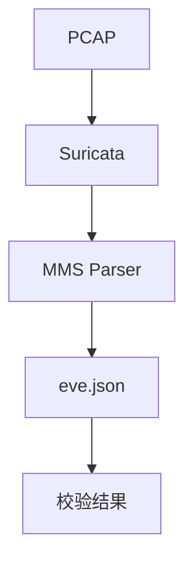
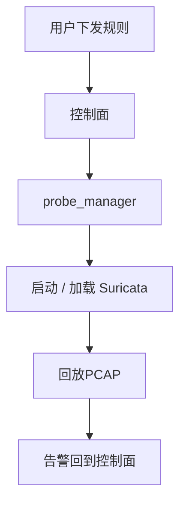

# AI时代程序员如何建立代码质量护栏

## 分享背景

AI Coding 正在改变软件开发方式。

传统开发流程：

```text
需求
 ↓
设计
 ↓
编码
 ↓
测试
 ↓
上线
```

AI辅助开发流程：

```text
需求描述
 ↓
AI生成代码
 ↓
人工Review
 ↓
测试验证
 ↓
持续优化
```

AI让代码生成变得越来越容易。

 但是新的问题出现了： 

**以前：** 程序员花大量时间写代码。 

**现在：** 程序员花越来越多时间理解、Review和验证AI生成的代码。 

**因为：** 生成代码 ≠ 生成正确代码。

AI生成的代码如何证明它是正确的？


**新的工程问题：** 

AI生成的代码：

 如何证明它符合业务要求？ 

如何证明它在真实环境中可靠？ 

如何证明它面对异常输入仍然安全？

上述问题就是我们今天要着重分享的内容。


---

# 第一章：AI Coding时代，为什么需要质量护栏？

## 1.1 AI生成代码带来的变化

AI现在可以快速生成：

- 函数
- 类
- 模块
- 接口实现
- 测试代码

但是AI无法天然保证：

- 业务逻辑正确
- 边界条件完整
- 异常流程合理
- 系统行为符合预期


---

## 1.3 程序员角色变化


过去：

```text
写代码的人
```


AI时代：

```text
代码设计者

+

AI输出Review者

+

系统质量负责人
```


核心能力变化：

从：

> 如何快速实现功能


变成：

> 如何定义正确性，并验证AI输出是否可靠。


---

## 1.4 质量护栏总览

后续四章分别对应一类护栏。先看清各自解决什么问题、用什么手段，再进入细节。

| 护栏 | 解决什么问题 | 手段 |
|---|---|---|
| 代码正确性 | 模块/组件是否可靠 | Unit Test + Integration Test |
| 系统可用性 | 产品流程是否真正可用 | E2E Test |
| 业务与边界 | 人、模块之间理解是否一致 | BDD + Contract Test |
| 可靠性 | 正确之外是否稳定、安全、可验证 | Fuzz + Performance + Mutation Test |


---

# 第二章：代码正确性护栏

Unit Test + Integration Test


代码正确性护栏解决：

> AI生成的代码，在模块和组件层面是否可靠？


---

## 2.1 Unit Test（单元测试）


### 目标

验证：

- 函数逻辑
- 核心算法
- 状态变化
- 边界条件


核心原则：

> 不测试实现，而测试行为。


---

### AI生成测试常见问题


AI生成测试最常见的问题，不是测试跑不过，而是测试看起来通过了，却没有证明任何业务正确性。


最常见的五类问题：

1. 测试目标不明确，只验证代码执行成功
2. 测试数据过于简单，脱离真实场景
3. 只覆盖Happy Path，缺少异常场景
4. 过度Mock，测试失去意义
5. 测试断言过弱


---

#### 1. 测试目标不明确，只验证代码执行成功


这是最常见的问题。


AI看到一个函数：

```go
func ParseMMS(data []byte) (*MMSMessage, error)
```


可能生成：

```go
func TestParseMMS(t *testing.T) {

    result, err := ParseMMS(data)

    assert.NoError(t, err)

    assert.NotNil(t, result)
}
```


这个测试只能证明：

> 函数没有报错


但是没有验证：

- MMS service 是否正确
- invoke-id 是否正确
- variable name 是否正确
- 字段解析是否符合协议


更简单的例子同样成立：

**错误：**

```go
result := Add(1, 2)

assert.NotNil(result)
```

**正确：**

```go
assert.Equal(
    3,
    Add(1, 2),
)
```


对于协议解析，真正关心的是：

**输入：**

```text
MMS Read Request
```

**输出：**

```json
{
 "service":"read",
 "variable":"FCX001"
}
```


而不是一个无业务意义的结果：

```text
result != nil
```


---

#### 2. 测试数据过于简单，脱离真实场景


AI生成测试时，经常会自己构造流量数据包二进制内容：

```go
packet := []byte{
    0x01,
    0x02,
    0x03,
}
```


问题：

- **可能不符合真实协议**
- **没有覆盖真实结构**
- **无法发现实际问题**


对于 IEC61850 MMS，更有价值的是：

```text
真实PCAP
 ↓
提取MMS报文
 ↓
作为测试输入
```


例如：

- mms_read_request.pcap
- mms_write_request.pcap
- mms_report.pcap


核心原则：

> 测试数据应该来自真实业务，而不是AI随便生成的数据。


---

#### 3. 只覆盖Happy Path，缺少异常场景


AI通常优先生成正常流程：

```text
正常MMS请求

 ↓

解析成功
```


但是工程系统真正容易出问题的是异常情况：


```text
空数据

 ↓

解析失败
```


```text
截断报文

 ↓

不能Crash
```


```text
非法BER编码

 ↓

返回错误
```


所以AI生成测试容易遗漏：

- 空输入
- 边界长度
- 非法字段
- 异常状态


---

#### 4. 过度Mock，测试失去意义


AI生成单元测试时，容易为了降低测试复杂度，大量使用Mock。


真实流程：

```text
IEC61850 MMS报文

 ↓

MMS Parser

 ↓

Event事件

 ↓

规则检测

 ↓

安全告警
```


AI生成测试：

```text
Mock MMS Parser

 ↓

生成Event

 ↓

验证告警
```


这个测试验证的是：

> Mock数据能否触发告警


而不是：

> MMS Parser是否能够正确解析真实报文


如果Parser存在解析错误：

测试仍然通过。


正确原则：

> Mock用于隔离外部依赖，不应该替代核心业务逻辑。


对于协议解析场景，应该使用真实MMS报文作为输入：

```text
MMS PCAP

 ↓

MMS Parser

 ↓

验证解析结果
```


验证：

- 协议字段是否正确
- 业务行为是否符合预期


---

#### 5. 测试断言过弱


这是AI生成测试最大的质量问题之一。


AI生成：

```go
assert.NotNil(result)
```


或者：

```go
assert.NoError(err)
```


这些断言价值有限。


更好的方式是验证业务结果：

```go
assert.Equal(
    "read",
    result.Service,
)

assert.Equal(
    "xxx",
    result.Variable,
)
```


对于协议解析，应该验证：

- 字段
- 类型
- 状态
- 业务含义


---

五类问题的共同本质：

> 测试通过了，但没有定义“什么才算正确”。


因此单元测试必须回答：

- 测的是什么行为
- 输入是否来自真实场景
- 断言的是否是业务结果
- 异常路径是否被覆盖
- Mock是否只隔离外部依赖，没隔离核心业务（这个比较难）


---

### 工程实践案例：流量侧控制面

```
// Scenario: 查询当前 Suricata 进程状态。
// Given Supervisor 保存 running、ready、PID 和重启次数等状态
// When  请求 GET /api/v1/process
// Then  返回 200，并完整回报进程状态快照
func TestProcessStatus(t *testing.T) {
	// Given Supervisor 保存 running、ready、PID 和重启次数等状态
	process := &suricatatest.Controller{Status: suricata.ProcessStatus{
		State:        suricata.ProcessRunning,
		Ready:        true,
		PID:          intPtr(4242),
		RestartCount: 2,
	}}
	s := setupTestServer(t, process)
	req := httptest.NewRequest("GET", "/api/v1/process", nil)
	w := httptest.NewRecorder()

	// When 请求 GET /api/v1/process
	s.Handler().ServeHTTP(w, req)

	// Then 返回 200，并完整回报进程状态快照
	if w.Code != http.StatusOK {
		t.Fatalf("status code = %d, want 200", w.Code)
	}
	var body struct {
		Code    int                    `json:"code"`
		Message string                 `json:"msg"`
		Data    map[string]interface{} `json:"data"`
	}
	if err := json.NewDecoder(w.Body).Decode(&body); err != nil {
		t.Fatalf("decode response: %v", err)
	}
	if body.Code != http.StatusOK || body.Message != "" {
		t.Fatalf("响应外层 = %+v，期望 code=200、msg 为空", body)
	}
	if len(body.Data) != 5 {
		t.Fatalf("data = %#v，期望恰好 5 个字段", body.Data)
	}
	if body.Data["state"] != "running" ||
		body.Data["ready"] != true || body.Data["pid"] != float64(4242) ||
		body.Data["restart_count"] != float64(2) || body.Data["capture_ifaces"] != nil {
		t.Fatalf("process status = %#v", body.Data)
	}
}
```

上述测试中是一个非常典型的**行为驱动测试（BDD）描述方式**。

它描述的是：

```
输入条件
    ↓
系统行为
    ↓
期望结果
```

也就是：

```
Given（前置条件）

When（触发行为）

Then（预期结果）
```

而”Scenario: 查询当前 Suricata 进程状态“是让研发人员、测试人员都能一眼明白这个测试的用途。


---

## 2.2 Integration Test（集成测试）

### 1）为什么需要集成测试？


真实Bug很多不是发生在单个函数内部，而是发生在模块交互过程中：

```text
模块A

 ↓

接口

 ↓

模块B

 ↓

外部依赖
```

常见问题：

- 模块接口理解不一致
- 数据格式不匹配
- 配置没有正确生效
- 调用流程异常

尤其在 AI Coding 时代：

> 不同模块可能由 AI 分别生成，单个模块测试通过，并不代表整个系统组合后一定正确。


---

### 2）集成测试工程实践

#### 1. 使用真实业务数据作为测试输入

集成测试不要依赖人工构造的简单数据。

例如协议解析项目：

不要：

```
随机构造几个字节

↓

调用Parser

↓

验证结果
```

应该：

```
真实PCAP文件

↓

Suricata

↓

MMS Parser

↓

Event输出

↓

结果验证
```

优势：

- 更接近真实运行环境
- 能发现真实协议问题
- Bug容易复现
- 适合长期回归测试

测试数据示例：

```
tests/

├── pcaps/

│   ├── mms_read.pcap

│   ├── mms_write.pcap

│   ├── mms_report.pcap

│   └── malformed_mms.pcap


└── expected/

    ├── mms_read.json

    ├── mms_write.json

    └── mms_report.json
```

------

#### 2. 使用期望结果进行自动验证（Golden Test）

集成测试不能依赖人工查看输出。

例如：

输入：

```
mms_read.pcap
```

期望输出内容：

```
{
 "type":"MMS_READ",
 "variable":"Motor001",
 "status":"success"
}
```

测试自动比较：

```
实际输出 VS 期望结果
```

#### 3. 测试环境自动化

集成测试最大的痛点：

> 环境准备复杂。

不要依赖人工：

```
启动Suricata

修改配置

加载规则

执行PCAP

查看结果
```

推荐：

将测试环境代码化。

#### 4. 集成测试一键执行

好的集成测试应该：

> 任何开发人员都可以快速运行。

例如：

```
make integration-test
```

自动完成：

```
准备测试环境

↓

启动Suricata

↓

加载插件

↓

执行PCAP

↓

检查Event

↓

输出测试结果
```

避免：

```
修改配置

↓

手动启动

↓

手动发送流量

↓

人工查看日志
```

否则测试很难长期维护。


---


### 3）**工程实践案例：基于suricata-verify构建集成测试**

一次完整检测流程包含：

```
PCAP流量

↓

协议解析

↓

规则匹配

↓

事件输出

↓

结果验证
```

因此，需要通过集成测试验证整个检测链路。

suricata-verify测试流程：

```
测试用例

↓

PCAP文件

↓

Suricata运行

↓

加载配置和规则

↓

生成eve.json

↓

验证预期结果
```

suricata-verify提供： 

从真实流量到最终检测结果的自动化质量护栏。


---

# 第三章：系统可用性护栏

### E2E Test


系统可用性护栏解决：

> 整个产品流程是否真正可用？


---

### 为什么需要E2E？


单元测试：

> 一个函数是否正确。


集成测试：

> 多个模块是否正确协作。


但是：

> 用户最终使用的完整流程是否成功？

需要E2E。


---

### Integration Test 和 E2E 的边界


#### 集成测试：引擎内部


集成测试证明：

> 检测引擎对不对。




这是 suricata-verify 的路径：真实流量进入引擎，解析后落到 eve.json，再校验预期结果。

它不测控制面、probe_manager、配置下发。


#### E2E：产品闭环


E2E证明：

> 用户这条业务能不能跑通。




E2E 

**测试：**多了控制面和探针：规则从用户侧下发，告警必须回到控制面，用户才能看见。

**不测 ：**MMS 字段细节、每种畸形报文。

**对照：**


| 维度 | Unit | Integration | E2E |
|---|---|---|---|
| 证明什么 | 函数/模块行为正确 | 引擎内部链路正确 | 用户业务闭环可用 |
| 起点 | 函数入参 | PCAP | 用户下发规则 |
| 终点 | 返回值/状态 | eve.json | 控制面能查到告警 |
| 不测什么 | 模块协作、产品流程 | 控制面、probe_manager、配置下发 | MMS 字段细节、每种畸形报文 |


一句话：

> 集成测试验证引擎内部链路，E2E验证产品闭环。


---

### E2E测试验证内容


从真实用户行为开始：

```text
用户操作

 ↓

系统入口

 ↓

多个模块协作

 ↓

最终结果
```


---

备注：现在流量侧产品还处于MVP阶段，暂时不需要E2E测试，但是t-agent可能更需要E2E测试这种。


---

# 第四章：业务与边界护栏

**BDD行测驱动开发 + 契约测试Contract Test**


业务与边界护栏解决：

> AI生成代码时，人、模块之间是否理解一致？


---

## 4.1 BDD（Behavior Driven Development）


### 为什么AI时代需要BDD？


AI擅长：

> 代码实现


AI不擅长：

> 业务理解


BDD通过业务语言描述：

> 什么行为才算正确。


---

### 示例：IEC61850 MMS异常检测


```gherkin
Scenario:
IEC61850 MMS异常访问检测

Given:
收到异常MMS Read请求

When:
流量经过检测引擎

Then:
产生安全告警
```


---

### BDD价值


- 需求即测试
- 测试即文档
- 帮助AI理解业务目标


---

## 4.2 Contract Test（接口契约测试）


### 解决问题


模块之间：

> 约定被破坏。

### 适用范围

- API接口
- 插件接口
- 模块接口
- 数据格式


---

### Suricata项目案例


```text
Rust MMS Parser

        ↓

Event JSON

        ↓

控制面
```


定义契约：

```json
{
"type":"MMS_ALERT",
"level":"high"
}
```


保证：

- 字段稳定
- 类型稳定
- 数据语义稳定


---

# 第五章：可靠性护栏

**Fuzz + Performance + Mutation Test**


可靠性护栏解决：

> 系统不仅要正确，还要稳定、安全、可验证。


---

## 5.1 Fuzz Testing


### 为什么协议项目必须关注？


普通测试：

```text
正常输入

 ↓

正确输出
```


真实攻击：

```text
异常输入

 ↓

系统Crash
```


---

### IEC61850 MMS Fuzz案例


输入：

- 非法BER编码
- 错误Length
- 截断报文
- 随机字段组合


目标：

不是：

> 返回正确结果


而是：

> 任意输入不能导致系统崩溃。


---

### 推荐工具


Rust：

- cargo-fuzz


Go：

- Go Native Fuzz


---

## 5.2 Performance Test


### 功能正确 ≠ 工程可用


安全产品需要：

- 高吞吐
- 低延迟
- 低资源消耗


---

### Suricata性能测试


关注：

- PPS
- CPU
- Memory
- Drop Rate


---

## 5.3 Mutation Testing


### 为什么需要Mutation Testing？


AI时代：

AI可以生成大量测试。


但是：

> 这些测试真的有价值吗？


Mutation Testing验证：

如果代码偷偷被修改：

测试是否能够发现。


---

例如：

原代码：

```rust
if balance >= amount
```


修改：

```rust
if balance > amount
```


如果测试仍然通过：

说明测试不足。


---

### 推荐工具


Rust：

- cargo-mutants


通用：

- Mewt


---

# 第六章：AI时代测试工程实践


AI 可以生成测试，但：

> AI生成测试 ≠ 高质量测试。


日常只做两件事：人来 Review，机器来拦。


---

## 6.1 Review AI 生成的测试

对照第二章的五类问题，把检查沉淀成团队 Skill：


```text
Review下面测试代码：

检查：

1. 是否存在假测试
2. 是否只覆盖happy path
3. 是否存在弱断言
4. 是否mock过度
5. 是否缺少异常测试
6. 给出改进建议
```


---

## 6.2 接到 CI


E2E 环境用 Testcontainers 拉起：控制面 → probe_manager → Suricata。


Pull Request 上依次卡住：


```text
Pull Request

 ↓

Static Analysis

 ↓

Unit Test

 ↓

Mutation Test

 ↓

Fuzz Test

 ↓

Integration Test

 ↓

E2E Test

 ↓

Merge
```
