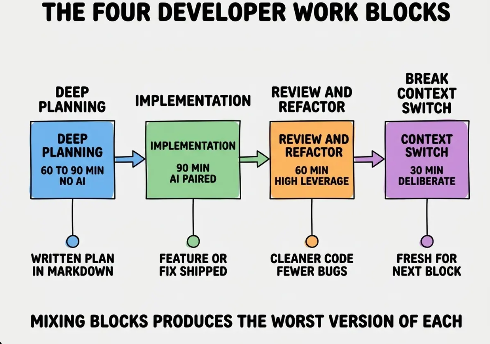
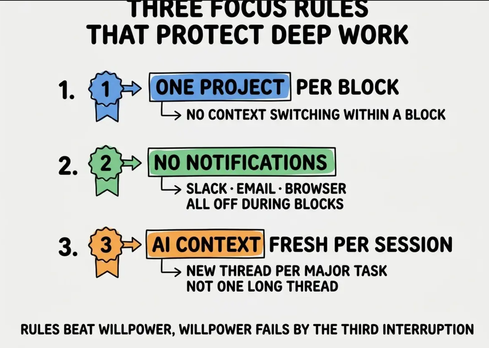

# 2026 年 AI 辅助开发的时间管理

当 AI 降低了写代码的成本后，开发者应该如何安排一天？哪些时段最适合产出？怎样安排工作节奏，避免过度疲劳？

过去，开发者的大部分时间花在手动编写代码上。现在，AI 可以快速生成大量代码，开发者反而需要把更多时间放在理解需求、设计方案和检查代码上。因此，一天最好分成四个阶段：先规划，再让 AI 协助实现，然后审查和整理代码，同时安排好休息，避免大脑过度疲劳。

按照这四个阶段安排工作，通常比没有明确安排就使用 Cursor 交付多 2 到 4 倍的有效成果。差距主要不在写代码的速度，而在规划和审查是否充分。

本文会介绍这四个阶段、如何把它们安排进一天、保护深度工作的专注规则，以及 AI 辅助开发中常见的时间管理误区。这些误区很容易让工程师损失一半的潜在产出。

## AI 为什么会改变时间管理

在 AI 出现之前，大多数开发者的瓶颈是打字。你可能已经想清楚要做什么，却还要花几个小时把想法写成代码。因此，那时的时间管理重点是保护长时间、不被打断的编码时段。

现在，大部分代码可以由 AI 协助完成，瓶颈因此转移到了更上游的思考、规划和审查。一天的安排也需要随之改变。

如果开发者仍然沿用 AI 出现前的工作方式，往往会把一天耗在漫长的 Cursor 会话里。过程看起来很忙，结果却很一般。没有结构的长时间 AI 会话容易不断积累小错误、遗漏架构决策，最后生成一堆需要大幅返工的代码。合理的安排，应该把更多时间留给 AI 无法替你完成的高价值工作。

## 核心结论

Linear 和 GitHub 团队在 2025 年进行了一项生产力研究，跟踪了 200 名使用 AI 工具的工程师。结果显示，把一天明确分成深度工作、实现和审查几个阶段的工程师，每周交付的有效成果是那些长时间、没有明确安排就使用 AI 工具的工程师的 3.2 倍。两组人的工作时长完全相同，差别只在时间如何分配。时间安排比工作时长更重要。

可以借鉴专业厨房安排出餐的方式。备料是一个专注阶段，烹饪出餐是另一个专注阶段，整天的流程则围绕这些阶段之间的转换来安排。厨师如果一边出餐一边备料，或者还没备好料就开始烹饪，菜品质量会下降，人也更容易疲惫。AI 辅助开发同样需要清楚地区分不同阶段。

## 四类工作时段

每个工作时段都有明确任务。把它们混在一起，只会让每一项工作都变得更糟。

这四类工作时段构成了 AI 辅助开发者的一天。每个工作时段都有明确任务；混在一起，只会让每一项工作都变得更糟。

**工作时段 1：深度规划（60 到 90 分钟，不使用 AI）。** 画出系统草图，确定架构，用 Markdown 写下计划。不写代码、不用 AI，也不开编辑器。这里是最需要高质量思考的地方；如果不刻意保护，它很容易被其他事情挤掉。

**工作时段 2：AI 协同实现（每次 90 分钟，每天 2 到 3 次）。** 打开 Cursor 或 Claude Code，挑计划里一个具体的小任务来做。一次只处理一个项目，不同时开多个任务或多段对话，通知也先关掉。90 分钟结束时，要有一块真正完成、能继续往前推进的成果。

**工作时段 3：审查与重构（60 分钟，每天 1 次）。** 查看当天完成的代码，整理混乱的部分，为重要功能补充测试，并同步更新文档。这一步能把“能运行的原型”提升为“可靠的专业成果”，但如果没有提前安排时间，它通常最容易被忽略。

**工作时段 4：休息与上下文切换（每个工作时段之间 30 分钟）。** 走走路、吃点东西，或者和别人聊聊天。有意识的休息可以重置注意力，预防职业倦怠。跳过休息，会明显降低下一个工作时段的质量。

## 把四类工作时段组合起来的日常节奏

高效的一天通常会安排这些工作时段，总时长约 8 小时。具体顺序可以调整，关键是持续执行。

一种常见安排是：早晨深度规划（90 分钟）→ 简短休息 → 第一次 AI 协同实现（45 分钟）→ 午休 → 第二次 AI 协同实现（45 分钟）→ 简短休息 → 审查与重构（60 分钟）→ 收尾。具体时长可以按公司节奏调整，关键是每一段都有明确任务。

例如，每天 9:00 上班，12:00 到 14:00 吃饭和午休，18:00 下班，可以这样安排：

- 9:00–9:45：查看昨天的进展，确定当天目标
- 9:45–10:00：晨会
- 10:00–11:30：深度规划
- 11:30–11:45：简短休息
- 11:45–12:00：第一次 AI 协同实现的启动和准备
- 12:00–14:00：午餐和午休
- 14:00–14:45：第一次 AI 协同实现
- 14:45–15:00：简短休息
- 15:00–15:45：第二次 AI 协同实现
- 15:45–16:00：简短休息
- 16:00–17:00：审查与重构
- 17:00–18:00：收尾、记录进展，并安排第二天的任务

这个安排不必机械地把每个工作时段都凑成固定时长。AI 协同实现可以拆成 45 分钟一段，中间用 10 到 15 分钟离开屏幕、喝水或整理思路。重点是提前分配时间，让规划、实现、审查和收尾都不会被临时事务挤掉。

相比之下，如果一整天都在使用 Cursor，中间只是想到什么时候就什么时候休息，看起来很忙，真正完成的工作却可能只有预期的 30% 到 40%。这种安排还容易让人疲惫不堪。有明确安排的工作日并没有延长工作时间，只是让每段时间都有明确目标，因此能完成更多真正有价值的工作。

## 保护深度工作的专注规则

知道有哪些工作时段只是第一步，更难的是保护它们不被打断。对 AI 辅助开发者来说，下面三条规则最实用。

规则比意志力可靠。只靠“我今天一定专注”，通常撑不过几次临时消息和会议插入。

**规则 1：每个工作时段只做一个项目。** 不要在一个工作时段里来回切项目。每切一次，你都要重新进入业务背景，也要重新让 AI 理解当前上下文。如果同时有多个项目，就把它们分到不同的工作时段里。

**规则 2：工作时段内关闭通知。** Slack、邮件和浏览器标签页都先关闭或静音。通知本身可能只打断 30 秒，但重新找回状态往往要花 5 到 15 分钟。真正贵的不是看消息的时间，而是注意力被打断后的恢复成本。

**规则 3：每个主要任务使用新的 AI 对话。** 不要把所有事情都塞进同一条超长对话里。对话越长，背景越混杂，AI 越容易被旧信息干扰。每个主要任务开一个新对话，只放和当前任务有关的资料，通常效果更稳定。

## 常见误区

**第一个误区，是把规划当成额外负担。**

对 AI 辅助开发来说，规划往往是当天杠杆最高的工作。它决定你要做什么，也决定了后面几小时的代码有没有价值。如果跳过规划，直接让 AI 开始写，很可能忙了一整天，最后才发现方向错了。用心规划 20 分钟，常常能省下几个小时返工。

**第二个误区，是把休息当成浪费时间。**

休息不是偷懒，而是让大脑从上一段任务里退出来。短暂离开屏幕、走动一下、喝水，都会让下一段工作更容易进入状态。一直硬撑并不会带来更多产出，只会让判断力下降，代码质量变差，人也更快疲惫。

还有一个小技巧：把深度规划放在和写代码不同的环境里。可以去会议室、咖啡店，或者只是换到另一个位置。环境变化会提醒大脑：现在不是急着写代码，而是先想清楚要做什么。这能减少“规划还没完成，就忍不住打开编辑器”的冲动。

## 这对你意味着什么

AI 辅助开发的时间管理是一项可以学习的技能，而且回报速度可能比其他职业投资都快。大多数开发者仍然拿 AI 工具套在 AI 时代之前的时间结构上，只获得了生产力提升的一小部分。

- **如果你是创业者：** 从第一天开始，就把这四类工作时段纳入团队预期。随意使用 Cursor 是一种文化选择，而且会不断放大负面影响。
- **如果你正在转行：** 在自己的作品集项目中练习这四类工作时段。面试时，如果你能清楚说明自己如何组织工作，这种纪律性会体现出来。
- **如果你是学生：** 每周尝试一天有明确安排的工作，再和没有明确安排的工作日比较。通常一个月内就能看出差距。
